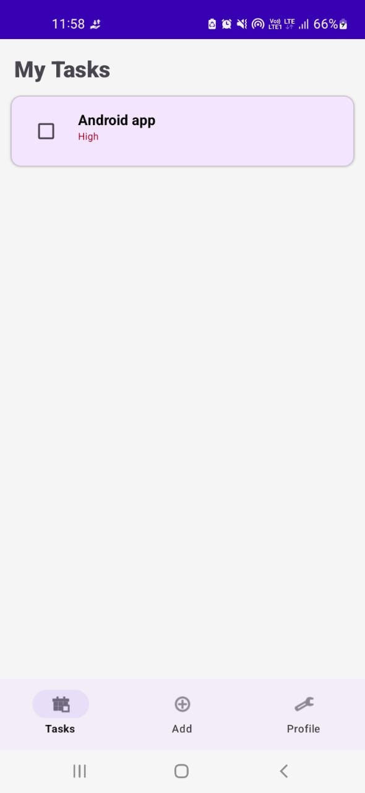
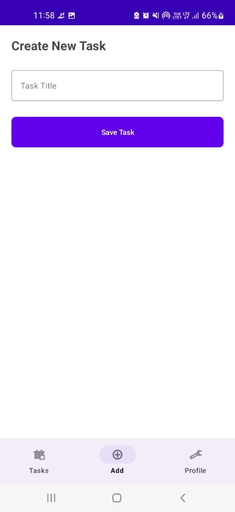
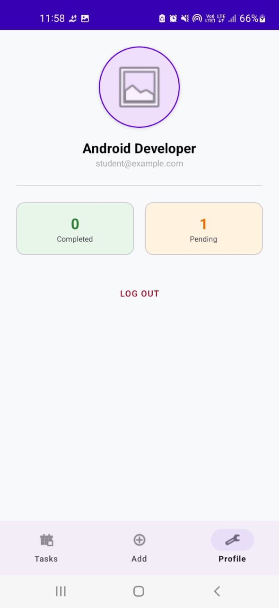

# Todo app 📝

A realistic, production-grade Android Todo application built using the **MVVM** pattern, **Room Database**, and **Clean Architecture** principles. This project focuses on high-performance local data persistence and modern UI/UX practices.


## 🚀 Features
* **CRUD Operations**: Create, Read, Update, and Delete tasks.
* **Real-time Updates**: Uses Kotlin **Flow** and **LiveData** for instant UI reactivity.
* **Modern Navigation**: Implemented with **Navigation Component** and **Bottom Navigation**.
* **Swipe to Delete**: Intuitive gesture-based task removal with an **Undo** option via Snackbar.
* **Persistence**: Data is stored locally in a **Room SQLite Database**.
* **Forced Light Theme**: Consistent brand experience regardless of system settings.
* **Responsive UI**: Built with **Material Design 3** components.

## 🏗️ Architecture
The app follows the **MVVM (Model-View-ViewModel)** architectural pattern to ensure a separation of concerns and testability.

* **View**: Fragments (`Home`, `Add`, `Profile`) using **ViewBinding**.
* **ViewModel**: Manages UI-related data and handles business logic via **Coroutines**.
* **Repository**: Serves as the single source of truth for the data layer.
* **Model**: **Room Entity** and **DAO** for structured data storage.


## 🛠️ Tech Stack & Tools
* **Language**: [Kotlin](https://kotlinlang.org/)
* **Local Database**: [Room](https://developer.android.com/training/data-storage/room)
* **Navigation**: [Jetpack Navigation Component](https://developer.android.com/guide/navigation)
* **Async Processing**: [Kotlin Coroutines](https://kotlinlang.org/docs/coroutines-overview.html) & [Flow](https://kotlinlang.org/docs/flow.html)
* **UI Components**: Material 3, RecyclerView, ConstraintLayout, ViewBinding.

## 📸 Screenshots
| Home Screen | Add Task | Profile Stats |
| :---: | :---: | :---: |
| |  |  |

## 🛠️ Installation
1. Clone the repository:
   ```bash
   git clone [https://github.com/your-username/Todo-App-Android.git](https://github.com/your-username/Todo-App-Android.git)
